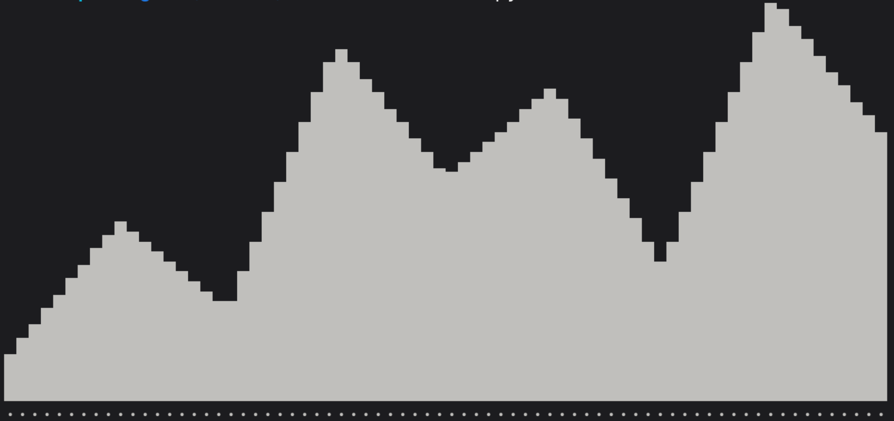
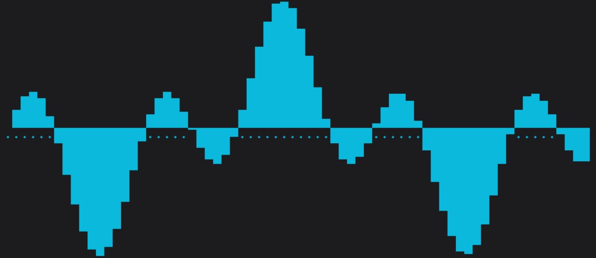
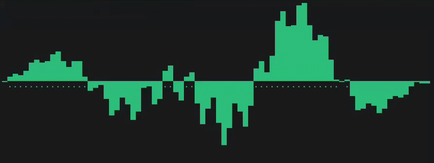

# bliplot

Stupidly simple terminal graphs. One function with zero config needed and sub-character resolution.

```python
from bliplot import plot
print(plot([1, 4, 2, 8, 5, 7, 3, 9, 6]))
```


That's it. That's the whole API.

## Why

Every terminal-plotting library makes you learn its DSL before you can see a
single number. `bliplot` is one function that takes a list and gives you back
a string. Print it, log it, pipe it, stream it... It doesn't care. It's yours !

## Install

```bash
pip install bliplot
```

or, if you're using [uv](https://github.com/astral-sh/uv):

```bash
uv add bliplot
```

## Usage

```python
import math
from bliplot import plot


def generate_waveform(x: float) -> float:
    return math.sin(x / 10) * math.cos(x / 5) * 10


data_points = [generate_waveform(x) for x in range(100)]

graph = plot(data_points, width=70, height=15, color="CYAN")
print(graph)
```


### Live / streaming graphs

Because `plot()` just returns a string, you can call it in a loop for a
live-updating graph. No special "live mode" needed:

```python
import math
import time
from bliplot import plot

CLEAR = "\033[H\033[J"
WIDTH = 80
HEIGHT = 15

# We run this for 200 frames of animation
for t in range(200):
    lst = []
    for x in range(WIDTH):
        # Moving the x offset by t * 0.2 causes the wave to travel left to right
        x_moving = x - (t * 0.2)

        # Base wave + high frequency noise
        wave = math.sin(x_moving * 0.2) * math.cos(x_moving * 0.05)
        noise = 0.2 * math.sin(x_moving * 1.5)

        # Center envelope to keep the edges clean
        envelope = math.exp(-((x - (WIDTH / 2)) / (WIDTH / 3)) ** 2)

        lst.append((wave + noise) * envelope)

    # Overwrite the screen
    print(
        CLEAR + plot(lst, width=WIDTH, height=HEIGHT, color="GREEN"), end="", flush=True
    )
    time.sleep(0.04)  # ~25 frames per second
```


The clear-screen escape redraws the graph in place instead of scrolling a
new one down the terminal on every iteration.

### Parameters

```python
plot(lst: list, width: int = None, height: int = None, color: str = None) -> str
```

| Param    | Type   | Default            | Description                                              |
|----------|--------|---------------------|------------------------------------------------------------|
| `lst`    | list   | —                   | Y values to plot. X values are inferred from index.        |
| `width`  | int    | terminal width      | Graph width in characters.                                  |
| `height` | int    | terminal height     | Graph height in characters.                                 |
| `color`  | str    | `None` (renders as white) | One of `RESET`, `GREEN`, `CYAN`, `YELLOW`, `RED`, `MAGENTA`, `BLUE`, `WHITE`, `BLACK`. |

Returns a string, ready to `print()`.

`NaN`, `+Inf`, and `-Inf` values in `lst` are treated as `0`.


## How it works

Terminal graphs are usually blocky because each character cell can only be
"on" or "off" so you lose all the resolution between one row of blocks and
the next. `bliplot` fixes this by spliting each value into an integer part and a fractional
remainder. The integer part decides how many full blocks (`█`) to stack.
The remainder picks *which* of the 8 partial block glyphs
(`▁▂▃▄▅▆▇█`) caps the column, giving you roughly 8x the vertical resolution.

Negative values use the upper-eighth block set (`▔🮂🮃▀🮄🮅🮆█`) so bars
growing downward from the midline look correct rather than upside-down.

## License

MIT